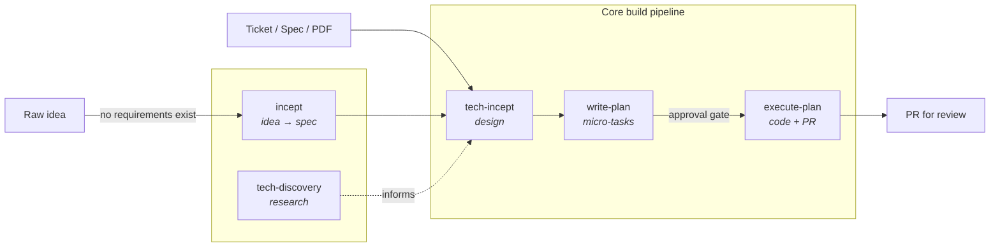

# agent-workbench

A downloadable agentic development workflow. Two install variants:

| Variant | Where | Shape | Pick when |
|---|---|---|---|
| **Standard** | root `skills/` + `adapters/` | Tool-neutral skill bodies + per-tool adapters | Want minimal-overhead install matching each tool's native conventions |
| **ICM** | `icm/` + root `skills/` + `references/` (assembled at install) | Layered workflow tree (WORKFLOW.md routes to skills, skills reference shared conventions) | Want a portable workflow tree you can copy as a unit |

Both variants ship the same five pipeline skills (incept, tech-discovery,
tech-incept, write-plan, execute-plan) and the same
`$ARTIFACT_DIR/<scope>/<slug>/` artifact layout.

## Install

```bash
git clone https://github.com/thicks/agent-workbench.git
cd agent-workbench

# Standard variant
./install.sh

# ICM variant
./install-icm.sh
```

Each script asks for a target project path and which tool (Claude Code,
Cursor, opencode, or all), then renders and copies the right files in.

## Pipeline



| You have... | Start with... |
|---|---|
| A raw idea, no written requirements | incept |
| A ticket, spec, user story, or PDF | tech-incept |
| An unfamiliar technology to research | tech-discovery |
| A design ready for planning | write-plan |
| An approved plan ready to build | execute-plan |

## Configuration

### Artifact directory

Planning artifacts (`<slug>-design.md`, `<slug>-plan.md`, etc.) are saved to
`$ARTIFACT_DIR/<scope>/<slug>/`. If `ARTIFACT_DIR` is not set, defaults to
`./artifacts/`.

`<scope>` is derived from the workspace path or an explicit `for <customer>`
phrase. See `references/artifact-dir.md` or
`adapters/claude/rules/30-artifact-dir.md` for the full scope rule.

Set `ARTIFACT_DIR` in your tool's local config:

| Tool | How |
|---|---|
| Claude Code | `.claude/settings.local.json` — `"env": {"ARTIFACT_DIR": "~/your/path"}` |
| Cursor | `.env` file — `ARTIFACT_DIR=~/your/path` |
| Shell | `export ARTIFACT_DIR=~/your/path` |

## Standard vs ICM

| Concern | Standard | ICM |
|---|---|---|
| Skill body location | `skills/<name>.md` (tool-neutral) | Same `skills/<name>.md` (assembled into `workflows/dev-workflow/skills/` at install) |
| References | Inlined or via `adapters/claude/rules/` | `references/` (assembled into `workflows/dev-workflow/references/` at install) |
| Tool coupling | Per-tool adapters render frontmatter at install | Workflow is tool-neutral; adapters are thin pointers |
| Best for | Quick install, tightest native tool integration | Portable workflow tree with auditing, review, retros |

## Design Principles

- **Self-contained workflow** — one folder holds the entire pipeline,
  portable across projects and tools
- **Layered context** — routing docs point to skills, skills reference
  stable conventions in references/
- **Plain text as interface** — every artifact, instruction, and convention
  is a markdown file
- **Stage contracts** — each skill defines what it reads, what it does,
  and what it produces
- **Tool-agnostic core** — no frontmatter or tool-specific syntax in the
  workflow; adapters are thin wrappers
