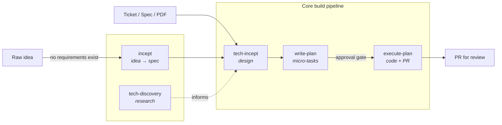

# agent-workbench

A downloadable agentic development workflow. `install.sh` renders
tool-neutral skill bodies from `skills/` plus per-tool adapters for
Claude Code, Cursor, and opencode.

The five pipeline skills (incept, tech-discovery, tech-incept, write-plan,
execute-plan) share the `$ARTIFACT_DIR/<scope>/<slug>/` artifact layout.
On-demand review skills (`spec-review`, `plan-review`, `code-review`,
`fix-failing-tests`) are optional quality gates — they are not automatic
and do not enforce pipeline order.

## Install

```bash
git clone https://github.com/thicks/agent-workbench.git
cd agent-workbench

./install.sh
```

The script asks for a target project path and which tool (Claude Code,
Cursor, opencode, or all), then renders and copies the right files in.

## Pipeline


```mermaid
flowchart LR
    idea["Raw idea"] -->|no requirements exist| incept
    reqs["Ticket / Spec / PDF"] --> tech-incept

    subgraph optional [" "]
        direction TB
        tech-discovery["tech-discovery\n<i>research</i>"]
        incept["incept\n<i>idea → spec</i>"]
    end

    incept --> tech-incept
    tech-discovery -.->|informs| tech-incept

    subgraph core ["Core build pipeline"]
        direction LR
        tech-incept["tech-incept\n<i>design</i>"] --> write-plan["write-plan\n<i>micro-tasks</i>"]
        write-plan -->|approval gate| execute-plan["execute-plan\n<i>code + PR</i>"]
    end

    execute-plan --> pr["PR for review"]
```

| You have... | Start with... |
|---|---|
| A raw idea, no written requirements | incept |
| A ticket, spec, user story, or PDF | tech-incept |
| An unfamiliar technology to research | tech-discovery |
| A design ready for planning | write-plan |
| An approved plan ready to build | execute-plan |

## Configuration

### Artifact directory

Planning artifacts (`<slug>-design.md`, `<slug>-plan.md`, etc.) are saved to
`$ARTIFACT_DIR/<scope>/<slug>/`. If `ARTIFACT_DIR` is not set, defaults to
`./artifacts/`.

`<scope>` is derived from the workspace path or an explicit `for <customer>`
phrase. See `references/artifact-dir.md` or
`adapters/claude/rules/30-artifact-dir.md` for the full scope rule.

Set `ARTIFACT_DIR` in your tool's local config:

| Tool | How |
|---|---|
| Claude Code | `.claude/settings.local.json` — `"env": {"ARTIFACT_DIR": "~/your/path"}` |
| Cursor | `.env` file — `ARTIFACT_DIR=~/your/path` |
| Shell | `export ARTIFACT_DIR=~/your/path` |

## Design Principles

- **Plain text as interface** — every artifact, instruction, and convention
  is a markdown file
- **Stage contracts** — each skill defines what it reads, what it does,
  and what it produces
- **Tool-agnostic core** — skill bodies live in `skills/`; adapters are
  thin wrappers that render tool-native frontmatter at install time
- **On-demand reviews** — quality gates are skills you invoke, not a
  hidden state machine
